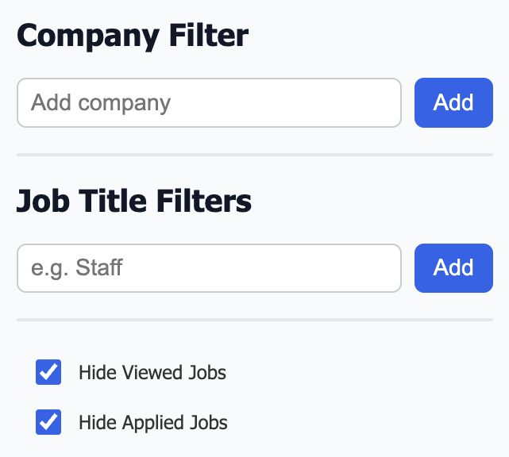

<h1 align="center">LinkedIn Job Filter Chrome Extension</h1>

## Description

A Chrome extension to help you filter LinkedIn job listings by **company blacklist**, **job title keywords**, and hide **viewed/applied/saved jobs** for a cleaner, more relevant job search experience.

---

## Features

- **Blacklist companies** you don’t want to see job listings from
- **Filter out jobs** by title keywords (e.g., exclude “Staff Engineer”, “Platform Engineer”)
- **Hide viewed, applied, and saved jobs** automatically
- Dynamically filters new jobs as you scroll on LinkedIn job search pages
- Easy to configure with a popup UI
- Stores preferences securely using Chrome storage sync

---

## Screenshots



---

## Installation

### For Non-Devs

1. Click **<> Code** green button in the upper right

2. Select **Download Zip**

3. Unpack the zip file and make it a folder. The folder name should unpack as **linkedin-job-filter-main**

4. Open Chrome and go to `chrome://extensions/`

5. Enable **Developer mode** (toggle on the top right)

6. Click **Load unpacked** (Upper left) and select this repo’s folder

7. The extension should now load and you can test it on LinkedIn job search pages

### From Source (Developer)

1. Clone this repository:

   ```bash
   git clone https://github.com/yourusername/linkedin-job-filter.git
   cd linkedin-job-filter
   ```

2. Open Chrome and go to `chrome://extensions/`

3. Enable **Developer mode** (toggle on the top right)

4. Click **Load unpacked** (Upper left) and select this repo’s folder

5. The extension should now load and you can test it on LinkedIn job search pages

### From Chrome Web Store

Coming soon possibly!

---

## Usage

1. Click the extension icon in your Chrome toolbar to open the popup

2. Add companies to blacklist or job title keywords to filter

3. Toggle options to hide viewed/applied/saved jobs

4. Browse LinkedIn jobs and enjoy a cleaner linkedin job feed

5. **If you update your list of companies, title preference, or viewed, applied, and saved, you will have to refresh the browser to apply those changes**

---

## Development

- `popup.html` — Popup UI for adding filters and toggles
- `popup.js` — Handles UI logic and syncs preferences to Chrome storage
- `content.js` — Runs on LinkedIn job pages, filters jobs dynamically based on preferences
- `popup.css` — Styles for the popup UI
- `manifest.json` — Chrome extension manifest defining permissions and resources

---

## Contributing

Contributions, issues, and feature requests are welcome!  
Feel free to open an issue or submit a pull request.

---

## License

MIT License

Copyright (c) 2025 Shaun Kapla

Permission is hereby granted, free of charge, to any person obtaining a copy
of this software and associated documentation files (the "Software"), to deal
in the Software without restriction, including without limitation the rights
to use, copy, modify, merge, publish, distribute, sublicense, and/or sell
copies of the Software, and to permit persons to whom the Software is
furnished to do so, subject to the following conditions:

The above copyright notice and this permission notice shall be included in all
copies or substantial portions of the Software.

THE SOFTWARE IS PROVIDED "AS IS", WITHOUT WARRANTY OF ANY KIND, EXPRESS OR
IMPLIED, INCLUDING BUT NOT LIMITED TO THE WARRANTIES OF MERCHANTABILITY,
FITNESS FOR A PARTICULAR PURPOSE AND NONINFRINGEMENT. IN NO EVENT SHALL THE
AUTHORS OR COPYRIGHT HOLDERS BE LIABLE FOR ANY CLAIM, DAMAGES OR OTHER
LIABILITY, WHETHER IN AN ACTION OF CONTRACT, TORT OR OTHERWISE, ARISING FROM,
OUT OF OR IN CONNECTION WITH THE SOFTWARE OR THE USE OR OTHER DEALINGS IN THE
SOFTWARE.
